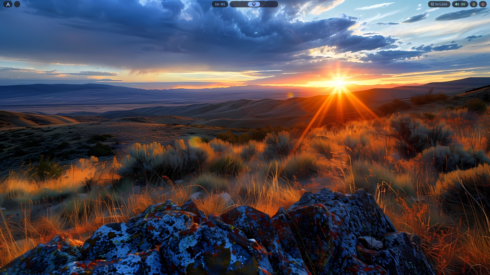
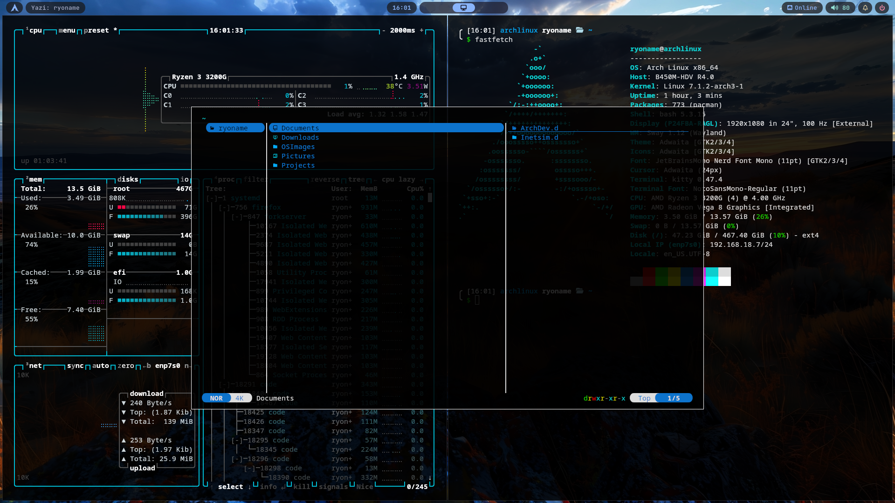

# simple-custom-sway

A clean, minimal, **Sway** desktop configuration featuring a lightweight tiling workflow, a transparent **Waybar** status bar, a black & white **Rofi** launcher, and a translucent **Kitty** terminal.


## Overview
This repository contains my personal dotfiles for a simple and distraction-free Wayland desktop built around [Sway](https://swaywm.org/). It focuses on:
- Lightweight
- Minimal, gap-based tiling layout
- Transparent, rounded, capsule-style Waybar modules
- A monochrome Rofi launcher with app/run/window mode switching
- A translucent, blurred Kitty terminal
- Sensible vim-style keybindings

## Components
| Component | Description |
|-----------|--------------|
| **Sway** | Window manager / Wayland compositor configuration |
| **Waybar** | Status bar with workspaces, clock, tray, network, audio, and notifications |
| **Rofi** | Application launcher / window switcher with a black & white theme |
| **Kitty** | GPU-accelerated terminal emulator with transparency and blur |

## Preview



## Requirements
Make sure the following packages are installed on your system:
- `sway`
- `waybar`
- `rofi`
- `kitty`
- `autotiling`
- `swaync` (notification daemon)
- `swaybg`
- `wlogout`
- `grim` + `slurp` (screenshots)
- `pavucontrol` / `wpctl` (audio control)
- `jq` (used in workspace scroll bindings)
- Nerd Font (e.g. `JetBrainsMono Nerd Font`) and `Figtree` font for Rofi

## Installation
1. Clone this repository:
   ```bash
   git clone https://github.com/Ryodev47/simple-custom-sway.git
   cd simple-custom-sway
   ```
2. Run the install script to symlink everything into `~/.config`:
   ```bash
   ./install.sh
   ```
   The script backs up any existing config folders (e.g. `sway.bak.<timestamp>`) before creating the symlinks, so it's safe to run even if you already have configs in place.
   Prefer to do it manually? Since the repo's `.config/` folder mirrors your real `~/.config/`, you can just copy or symlink it directly:
   ```bash
   # Copy
   cp -r .config/* ~/.config/
   # Or symlink (recommended, so `git pull` updates apply automatically)
   ln -sfn "$(pwd)/.config/sway"   ~/.config/sway
   ln -sfn "$(pwd)/.config/waybar" ~/.config/waybar
   ln -sfn "$(pwd)/.config/rofi"   ~/.config/rofi
   ln -sfn "$(pwd)/.config/kitty"  ~/.config/kitty
   ```
3. Update the wallpaper path in the Sway config (`output * bg ...`) to point to your own wallpaper.
   > This repo doesn't bundle the wallpaper file itself (to keep the repo lightweight and avoid redistributing someone else's image). The one used in the preview above is from WallpapersDen:
   > [Sunset Horizon HD Landscape](https://images.wallpapersden.com/image/download/sunset-horizon-hd-landscape_bmdnZWeUmZqaraWkpJRmbmdsrWZlbWU.jpg)
   >
   > Download it (or your own wallpaper) and place it somewhere like `~/Pictures/wallpaper/`, then update the path in `.config/sway/config`.
4. Reload Sway:
   ```bash
   swaymsg reload
   ```
   
## Key Bindings (Sway)
The modifier key is set to `Mod4` (Super/Windows key).
| Shortcut | Action |
|----------|--------|
| `Mod + Return` | Open terminal (Kitty) |
| `Mod + Q` | Open file manager (Yazi, floating) |
| `Mod + R` | Open Rofi launcher |
| `Mod + C` | Kill focused window |
| `Mod + Shift + C` | Reload Sway config |
| `Mod + Shift + E` | Exit Sway |
| `Mod + H/J/K/L` or arrow keys | Move focus |
| `Mod + Shift + H/J/K/L` or arrow keys | Move focused window |
| `Mod + 1..0` | Switch workspace |
| `Mod + Shift + 1..0` | Move window to workspace |
| `Mod + B` / `Mod + V` | Split horizontal / vertical |
| `Mod + S` / `Mod + W` / `Mod + E` | Stacking / Tabbed / Toggle split layout |
| `Mod + F` | Fullscreen toggle |
| `Mod + Shift + Space` | Floating toggle |
| `Mod + Space` | Toggle focus tiling/floating |
| `Mod + A` | Focus parent container |
| `Mod + Shift + P` | Take a region screenshot |
| `Mod + Scroll Wheel` | Switch workspaces |

## Theming Notes
- **Kitty**: `background_opacity 0.85`, `background_blur 1`, font size `11.0`, and custom window padding for a clean look.
- **Rofi**: Fully monochrome (black background, white text/highlights), rounded corners, and a bottom mode-switcher for `drun`, `run`, and `window` modes.
- **Waybar**: Transparent bar with capsule-style modules using a Catppuccin-inspired accent palette on a dark, semi-transparent background.

## Repository Structure
```
simple-custom-sway/
├── .config/
│   ├── sway/
│   │   └── config
│   ├── waybar/
│   │   ├── config.jsonc
│   │   └── style.css
│   ├── kitty/
│   │   └── kitty.conf
│   └── rofi/
│       └── config.rasi
├── assets/
│   ├── screenshot-desktop.png
│   └── screenshot-terminal.png
├── .gitignore
├── README.md
└── install.sh
```

The `.config/` folder mirrors your real `~/.config/` directory 1:1, so installing is just a matter of symlinking (or copying) each subfolder into place.
## Credits
- [Sway](https://swaywm.org/)
- [Waybar](https://github.com/Alexays/Waybar)
- [Rofi](https://github.com/davatorium/rofi)
- [Kitty](https://sw.kovidgoyal.net/kitty/)
- [Papirus Icon Theme](https://github.com/PapirusDevelopmentTeam/papirus-icon-theme)
- [JetBrains Mono Nerd Font](https://www.nerdfonts.com/)

## License
This project is licensed under the [MIT License](LICENSE) — feel free to use, modify, and distribute it.
